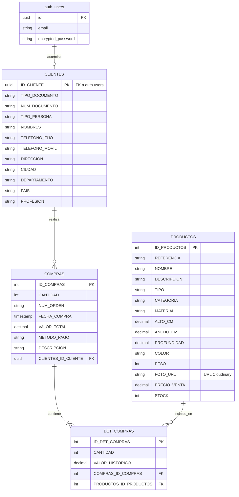

# Modelo de Base de Datos: Muebles los Alpes

Documentación completa y especificación técnica del modelo de base de datos relacional para el sistema de Muebles los Alpes hospedado en **Supabase (PostgreSQL)**, integrado con **Supabase Auth** y **Cloudinary**.

---

## Objetivo

Proveer una referencia completa de la estructura de la base de datos relacional, sus entidades, atributos, claves primarias/foráneas, políticas de seguridad (RLS), funciones almacenadas (RPC/Triggers para control de stock) y los scripts DDL SQL listos para desplegar en el SQL Editor de Supabase.

---

## Contenido

### 1. Motor de Base de Datos y Servicios

- **Tipo:** Relacional (RDBMS)
- **Motor:** PostgreSQL (Hospedado en Supabase)
- **Autenticación:** Supabase Auth nativo (`auth.users`)
- **Imágenes & Media:** Cloudinary (almacenamiento y CDN externo referenciado mediante la columna `FOTO_URL`)
- **Seguridad:** Row Level Security (RLS) activo por tabla
- **Lógica Transaccional:** Funciones SQL Almacenadas (RPC) en PostgreSQL para desfalco atómico de inventario (`STOCK`).

---

### 2. Diccionario de Datos (Tablas y Atributos)

> **Nota sobre Autenticación:** La gestión de credenciales (correo, contraseña encriptada, tokens JWT) es manejada nativamente por Supabase en el esquema `auth.users`. La tabla `CLIENTES` se conecta directamente con `auth.users` mediante un identificador de tipo `UUID`.

#### 2.1 Tabla: `CLIENTES`
Contiene la información personal y de contacto del cliente, vinculada a su cuenta de Supabase Auth.

| Columna | Tipo de Dato | Clave | Descripción |
| :--- | :--- | :--- | :--- |
| `ID_CLIENTE` | `UUID` | **PK / FK** | Identificador del cliente (Referencia a `auth.users(id)`) |
| `TIPO_DOCUMENTO` | `VARCHAR(45)` | | Tipo de documento (CC, CE, NIT, Pasaporte) |
| `NUM_DOCUMENTO` | `VARCHAR(20)` | | Número del documento de identidad |
| `TIPO_PERSONA` | `VARCHAR(45)` | | Tipo de persona (Natural / Jurídica) |
| `NOMBRES` | `VARCHAR(100)` | | Nombres y apellidos completos |
| `TELEFONO_FIJO` | `VARCHAR(15)` | | Número de teléfono fijo |
| `TELEFONO_MOVIL` | `VARCHAR(15)` | | Número de teléfono celular/móvil |
| `DIRECCION` | `VARCHAR(100)` | | Dirección de residencia o entrega |
| `CIUDAD` | `VARCHAR(45)` | | Ciudad de residencia |
| `DEPARTAMENTO` | `VARCHAR(45)` | | Departamento o estado de residencia |
| `PAIS` | `VARCHAR(45)` | | País de residencia |
| `PROFESION` | `VARCHAR(45)` | | Ocupación o profesión del cliente |

#### 2.2 Tabla: `PRODUCTOS`
Catálogo de muebles disponibles para la venta con sus características físicas y de inventario.

| Columna | Tipo de Dato | Clave | Descripción |
| :--- | :--- | :--- | :--- |
| `ID_PRODUCTOS` | `SERIAL` | **PK** | Identificador único del producto |
| `REFERENCIA` | `VARCHAR(45)` | | Código o referencia comercial del mueble |
| `NOMBRE` | `VARCHAR(100)` | | Nombre del producto |
| `DESCRIPCION` | `TEXT` | | Descripción detallada o especificaciones |
| `TIPO` | `VARCHAR(45)` | | Clasificación del mueble (Interior / Exterior) |
| `CATEGORIA` | `VARCHAR(45)` | | Categoría del mueble (Mesa, Silla, Sofá, etc.) |
| `MATERIAL` | `VARCHAR(45)` | | Material de fabricación (Madera, Metal, Cuero) |
| `ALTO_CM` | `DECIMAL(6,2)` | | Dimensión de alto en centímetros |
| `ANCHO_CM` | `DECIMAL(6,2)` | | Dimensión de ancho en centímetros |
| `PROFUNDIDAD` | `DECIMAL(6,2)` | | Dimensión de profundidad en centímetros |
| `COLOR` | `VARCHAR(45)` | | Color o acabado |
| `PESO` | `INT` | | Peso del producto en gramos |
| `FOTO_URL` | `VARCHAR(255)` | | URL pública CDN enviada desde Cloudinary |
| `PRECIO_VENTA` | `DECIMAL(12,2)`| | Precio unitario de venta |
| `STOCK` | `INT` | | Unidades disponibles en inventario (controlado vía RPC/Trigger) |

#### 2.3 Tabla: `COMPRAS`
Registra las órdenes de compra de los clientes.

| Columna | Tipo de Dato | Clave | Descripción |
| :--- | :--- | :--- | :--- |
| `ID_COMPRAS` | `SERIAL` | **PK** | Identificador único de la compra |
| `CANTIDAD` | `INT` | | Cantidad total de productos en la orden |
| `NUM_ORDEN` | `VARCHAR(45)` | | Número consecutivo de orden de compra |
| `FECHA_COMPRA` | `TIMESTAMP` | | Fecha y hora en que se ejecutó la compra |
| `VALOR_TOTAL` | `DECIMAL(12,2)`| | Valor total a pagar en la transacción |
| `METODO_PAGO` | `VARCHAR(45)` | | Método de pago (Tarjeta, Transferencia, PSE) |
| `DESCRIPCION` | `VARCHAR(200)` | | Notas u observaciones de la compra |
| `CLIENTES_ID_CLIENTE`| `UUID` | **FK** | Referencia a `CLIENTES(ID_CLIENTE)` |

#### 2.4 Tabla: `DET_COMPRAS`
Tabla de detalle que especifica los productos individuales de cada compra.

| Columna | Tipo de Dato | Clave | Descripción |
| :--- | :--- | :--- | :--- |
| `ID_DET_COMPRAS` | `SERIAL` | **PK** | Identificador único del detalle de compra |
| `CANTIDAD` | `INT` | | Cantidad solicitada de este producto |
| `VALOR_HISTORICO` | `DECIMAL(12,2)`| | Precio congelado al momento del pago |
| `COMPRAS_ID_COMPRAS`| `INT` | **FK** | Referencia a `COMPRAS(ID_COMPRAS)` |
| `PRODUCTOS_ID_PRODUCTOS`| `INT` | **FK** | Referencia a `PRODUCTOS(ID_PRODUCTOS)` |

---

### 3. Diagrama Entidad-Relación (ERD)



---

### 4. Script DDL completo para Supabase (PostgreSQL, RLS & Trigger de Stock)

Ejecutar este script completo en el **SQL Editor** de Supabase:

```sql
-- 1. Tabla CLIENTES (Vinculada a auth.users de Supabase)
CREATE TABLE IF NOT EXISTS CLIENTES (
    ID_CLIENTE UUID PRIMARY KEY REFERENCES auth.users(id) ON DELETE CASCADE,
    TIPO_DOCUMENTO VARCHAR(45) NOT NULL,
    NUM_DOCUMENTO VARCHAR(20) NOT NULL UNIQUE,
    TIPO_PERSONA VARCHAR(45),
    NOMBRES VARCHAR(100) NOT NULL,
    TELEFONO_FIJO VARCHAR(15) NOT NULL,
    TELEFONO_MOVIL VARCHAR(15),
    DIRECCION VARCHAR(100) NOT NULL,
    CIUDAD VARCHAR(45) NOT NULL,
    DEPARTAMENTO VARCHAR(45) NOT NULL,
    PAIS VARCHAR(45) NOT NULL,
    PROFESION VARCHAR(45)
);

-- 2. Tabla PRODUCTOS (Imágenes gestionadas en Cloudinary)
CREATE TABLE IF NOT EXISTS PRODUCTOS (
    ID_PRODUCTOS SERIAL PRIMARY KEY,
    REFERENCIA VARCHAR(45) NOT NULL UNIQUE,
    NOMBRE VARCHAR(100) NOT NULL,
    DESCRIPCION TEXT,
    TIPO VARCHAR(45),
    CATEGORIA VARCHAR(45),
    MATERIAL VARCHAR(45),
    ALTO_CM DECIMAL(6,2) NOT NULL,
    ANCHO_CM DECIMAL(6,2) NOT NULL,
    PROFUNDIDAD DECIMAL(6,2) NOT NULL,
    COLOR VARCHAR(45),
    PESO INT NOT NULL,
    FOTO_URL VARCHAR(255), -- URL externa Cloudinary
    PRECIO_VENTA DECIMAL(12,2) NOT NULL,
    STOCK INT NOT NULL DEFAULT 0 CHECK (STOCK >= 0)
);

-- 3. Tabla COMPRAS
CREATE TABLE IF NOT EXISTS COMPRAS (
    ID_COMPRAS SERIAL PRIMARY KEY,
    CANTIDAD INT NOT NULL,
    NUM_ORDEN VARCHAR(45) NOT NULL UNIQUE,
    FECHA_COMPRA TIMESTAMP WITH TIME ZONE DEFAULT CURRENT_TIMESTAMP,
    VALOR_TOTAL DECIMAL(12,2) NOT NULL,
    METODO_PAGO VARCHAR(45),
    DESCRIPCION VARCHAR(200),
    CLIENTES_ID_CLIENTE UUID REFERENCES CLIENTES(ID_CLIENTE) ON DELETE RESTRICT
);

-- 4. Tabla DET_COMPRAS
CREATE TABLE IF NOT EXISTS DET_COMPRAS (
    ID_DET_COMPRAS SERIAL PRIMARY KEY,
    CANTIDAD INT NOT NULL,
    VALOR_HISTORICO DECIMAL(12,2) NOT NULL,
    COMPRAS_ID_COMPRAS INT REFERENCES COMPRAS(ID_COMPRAS) ON DELETE CASCADE,
    PRODUCTOS_ID_PRODUCTOS INT REFERENCES PRODUCTOS(ID_PRODUCTOS) ON DELETE RESTRICT
);

-- Índices de Rendimiento
CREATE INDEX IF NOT EXISTS idx_compras_cliente ON COMPRAS(CLIENTES_ID_CLIENTE);
CREATE INDEX IF NOT EXISTS idx_det_compras_compras ON DET_COMPRAS(COMPRAS_ID_COMPRAS);
CREATE INDEX IF NOT EXISTS idx_det_compras_productos ON DET_COMPRAS(PRODUCTOS_ID_PRODUCTOS);

--------------------------------------------------------------------------------
-- 5. Lógica de Negocio: Trigger para Descuento Automático de STOCK
--------------------------------------------------------------------------------
CREATE OR REPLACE FUNCTION descontar_stock_producto()
RETURNS TRIGGER AS $$
BEGIN
    -- Verificar si existe stock suficiente
    IF (SELECT STOCK FROM PRODUCTOS WHERE ID_PRODUCTOS = NEW.PRODUCTOS_ID_PRODUCTOS) < NEW.CANTIDAD THEN
        RAISE EXCEPTION 'Stock insuficiente para el producto ID %', NEW.PRODUCTOS_ID_PRODUCTOS;
    END IF;

    -- Descontar el stock en la tabla PRODUCTOS
    UPDATE PRODUCTOS
    SET STOCK = STOCK - NEW.CANTIDAD
    WHERE ID_PRODUCTOS = NEW.PRODUCTOS_ID_PRODUCTOS;

    RETURN NEW;
END;
$$ LANGUAGE plpgsql;

CREATE OR REPLACE TRIGGER trg_descontar_stock
AFTER INSERT ON DET_COMPRAS
FOR EACH ROW
EXECUTE FUNCTION descontar_stock_producto();

--------------------------------------------------------------------------------
-- 6. Políticas de Seguridad: Row Level Security (RLS)
--------------------------------------------------------------------------------
ALTER TABLE CLIENTES ENABLE ROW LEVEL SECURITY;
ALTER TABLE PRODUCTOS ENABLE ROW LEVEL SECURITY;
ALTER TABLE COMPRAS ENABLE ROW LEVEL SECURITY;
ALTER TABLE DET_COMPRAS ENABLE ROW LEVEL SECURITY;

-- Políticas para PRODUCTOS (Lectura pública)
CREATE POLICY "Permitir lectura publica de productos"
    ON PRODUCTOS FOR SELECT
    USING (true);

-- Políticas para CLIENTES (Acceso restringido a su propio perfil)
CREATE POLICY "Clientes ven su propio perfil"
    ON CLIENTES FOR SELECT
    USING (auth.uid() = ID_CLIENTE);

CREATE POLICY "Clientes actualizan su propio perfil"
    ON CLIENTES FOR UPDATE
    USING (auth.uid() = ID_CLIENTE);

CREATE POLICY "Clientes insertan su propio perfil"
    ON CLIENTES FOR INSERT
    WITH CHECK (auth.uid() = ID_CLIENTE);

-- Políticas para COMPRAS (Clientes ven y crean sus propias compras)
CREATE POLICY "Clientes ven sus compras"
    ON COMPRAS FOR SELECT
    USING (auth.uid() = CLIENTES_ID_CLIENTE);

CREATE POLICY "Clientes crean sus compras"
    ON COMPRAS FOR INSERT
    WITH CHECK (auth.uid() = CLIENTES_ID_CLIENTE);

-- Políticas para DET_COMPRAS (Clientes ven los detalles de sus compras)
CREATE POLICY "Clientes ven detalles de sus compras"
    ON DET_COMPRAS FOR SELECT
    USING (
        EXISTS (
            SELECT 1 FROM COMPRAS
            WHERE COMPRAS.ID_COMPRAS = DET_COMPRAS.COMPRAS_ID_COMPRAS
            AND COMPRAS.CLIENTES_ID_CLIENTE = auth.uid()
        )
    );

CREATE POLICY "Clientes crean detalles de sus compras"
    ON DET_COMPRAS FOR INSERT
    WITH CHECK (
        EXISTS (
            SELECT 1 FROM COMPRAS
            WHERE COMPRAS.ID_COMPRAS = DET_COMPRAS.COMPRAS_ID_COMPRAS
            AND COMPRAS.CLIENTES_ID_CLIENTE = auth.uid()
        )
    );

--------------------------------------------------------------------------------
-- 7. Políticas de Seguridad: Rol Administrador
-- Nota: El administrador se identifica mediante un campo 'role' en los
-- metadatos del usuario (raw_app_meta_data->>'role' = 'admin') configurado
-- manualmente desde el Dashboard de Supabase Auth.
--------------------------------------------------------------------------------

-- Administrador: Acceso total a CLIENTES
CREATE POLICY "Admin lectura total de clientes"
    ON CLIENTES FOR SELECT
    USING ((auth.jwt()->'app_metadata'->>'role') = 'admin');

CREATE POLICY "Admin actualiza cualquier cliente"
    ON CLIENTES FOR UPDATE
    USING ((auth.jwt()->'app_metadata'->>'role') = 'admin');

CREATE POLICY "Admin elimina clientes"
    ON CLIENTES FOR DELETE
    USING ((auth.jwt()->'app_metadata'->>'role') = 'admin');

-- Administrador: Gestión completa de PRODUCTOS
CREATE POLICY "Admin gestiona productos (INSERT)"
    ON PRODUCTOS FOR INSERT
    WITH CHECK ((auth.jwt()->'app_metadata'->>'role') = 'admin');

CREATE POLICY "Admin gestiona productos (UPDATE)"
    ON PRODUCTOS FOR UPDATE
    USING ((auth.jwt()->'app_metadata'->>'role') = 'admin');

CREATE POLICY "Admin gestiona productos (DELETE)"
    ON PRODUCTOS FOR DELETE
    USING ((auth.jwt()->'app_metadata'->>'role') = 'admin');

-- Administrador: Lectura total de COMPRAS y DET_COMPRAS (para Reportes)
CREATE POLICY "Admin lectura total de compras"
    ON COMPRAS FOR SELECT
    USING ((auth.jwt()->'app_metadata'->>'role') = 'admin');

CREATE POLICY "Admin lectura total de detalles de compras"
    ON DET_COMPRAS FOR SELECT
    USING ((auth.jwt()->'app_metadata'->>'role') = 'admin');

--------------------------------------------------------------------------------
-- 8. Funciones Almacenadas (RPC) para Gestión de Usuarios
--------------------------------------------------------------------------------

-- Función para que un administrador convierta a un usuario común en administrador
CREATE OR REPLACE FUNCTION set_admin_role(target_user_id UUID)
RETURNS void AS $$
BEGIN
    -- Verificar que el usuario que ejecuta la función es administrador
    IF (auth.jwt()->'app_metadata'->>'role') != 'admin' THEN
        RAISE EXCEPTION 'No autorizado. Solo los administradores pueden realizar esta acción.';
    END IF;

    -- Actualizar los metadatos de app del usuario objetivo para asignar el rol admin
    UPDATE auth.users
    SET raw_app_meta_data = jsonb_set(COALESCE(raw_app_meta_data, '{}'::jsonb), '{role}', '"admin"')
    WHERE id = target_user_id;
END;
$$ LANGUAGE plpgsql SECURITY DEFINER SET search_path = public, auth;
```

---

## Relación con otros documentos

La base de datos se accede directamente mediante las funciones del cliente SDK descritas en la [API](API.md) y se rige por la arquitectura definida en [Diseño del Sistema](Diseno_Sistema.md).

- [Diseño del Sistema](Diseno_Sistema.md)
- [API](API.md)

---

## Navegación

← [Entradas, Procesos y Salidas](Entradas_Procesos_Salidas.md)
↑ [Índice de la Carpeta](README.md)
→ [API](API.md)

[MASTER](../MASTER.md)
