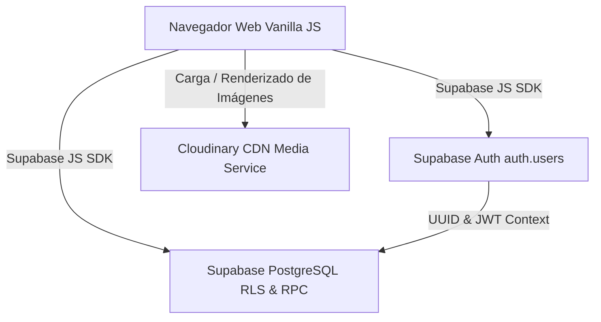

# Diseño del Sistema: Muebles los Alpes

Describe la arquitectura general del sistema, enfocada en la separación entre un cliente web estático puro (Vanilla JS), servicios Backend as a Service (BaaS) en **Supabase** y gestión de activos multimedia en **Cloudinary**.

---

## Objetivo

Permitir que un nuevo desarrollador comprenda cómo interactúan el Frontend (Vanilla JS), Supabase (Autenticación nativa y PostgreSQL) y Cloudinary (Almacenamiento y CDN de imágenes).

---

## Contenido

### 1. Patrón Arquitectónico

El sistema utiliza una arquitectura **Cliente-Servidor (Serverless / BaaS)**. No existe un servidor backend monolítico propio; toda la persistencia, autenticación nativa y lógica de base de datos se delegan a Supabase, mientras que la optimización y entrega de imágenes de productos se gestiona mediante Cloudinary.

---

### 2. Componentes Principales

- **Frontend (Web Estática):** Desarrollado estrictamente en HTML5, CSS3 (Vanilla) y JavaScript ES6+. Hospedado en Vercel.
- **Supabase Auth (BaaS):** Gestión nativa de identidad de usuarios (`auth.users`), tokens JWT y sesiones.
- **Supabase PostgreSQL (BaaS):** Base de datos relacional protegida con Row Level Security (RLS) y funciones SQL (RPC/Triggers) para operaciones atómicas.
- **Cloudinary (CDN & Media):** Plataforma externa para almacenamiento, transformación automática y entrega optimizada de las imágenes del catálogo (`FOTO_URL`).
- **Cliente Supabase JS:** SDK consumido directamente desde el navegador para interacción con Auth y PostgreSQL.

---

### 3. Diagrama de Arquitectura

---

## Relación con otros documentos

El diseño justifica las decisiones de infraestructura y se complementa con los detalles técnicos de la [Base de Datos](Base_Datos.md) y la [API](API.md).

- [Base de Datos](Base_Datos.md)
- [API](API.md)

---

## Navegación

← [Índice de Arquitectura](README.md)
↑ [Índice de la Carpeta](README.md)
→ [Entradas, Procesos y Salidas](Entradas_Procesos_Salidas.md)

[MASTER](../MASTER.md)
