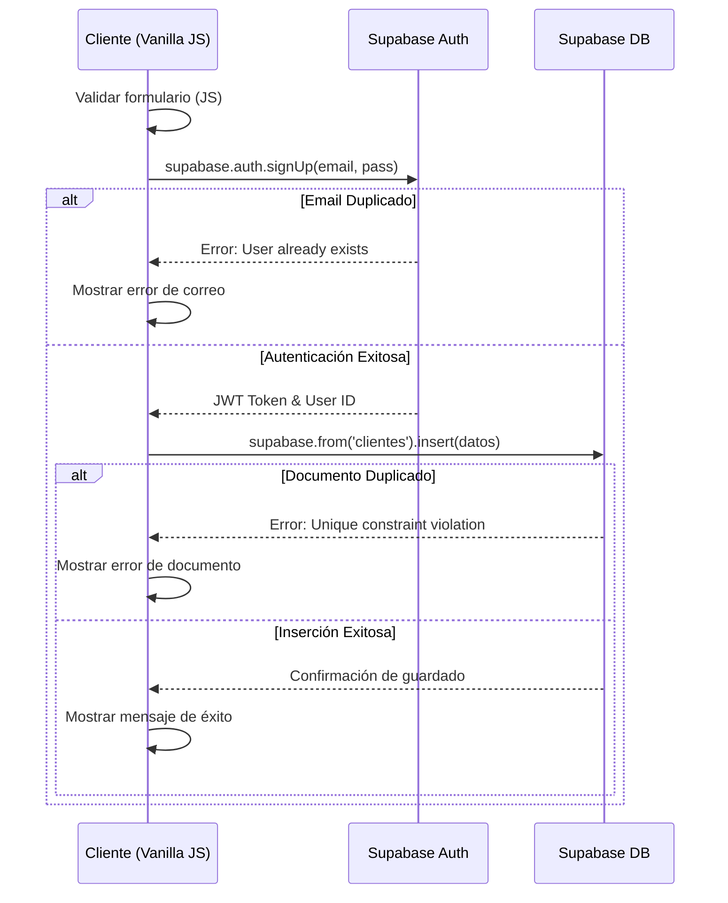
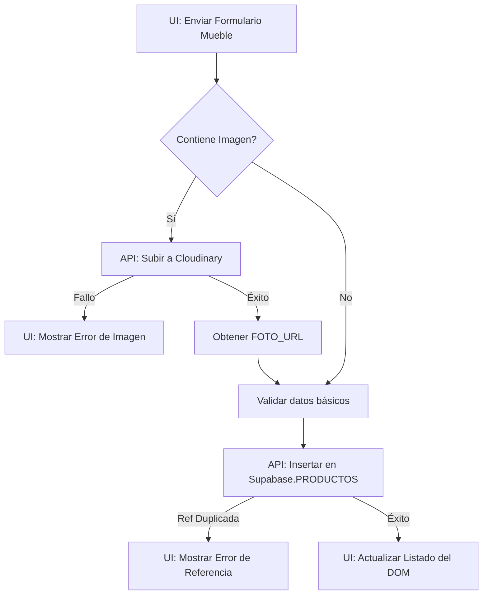
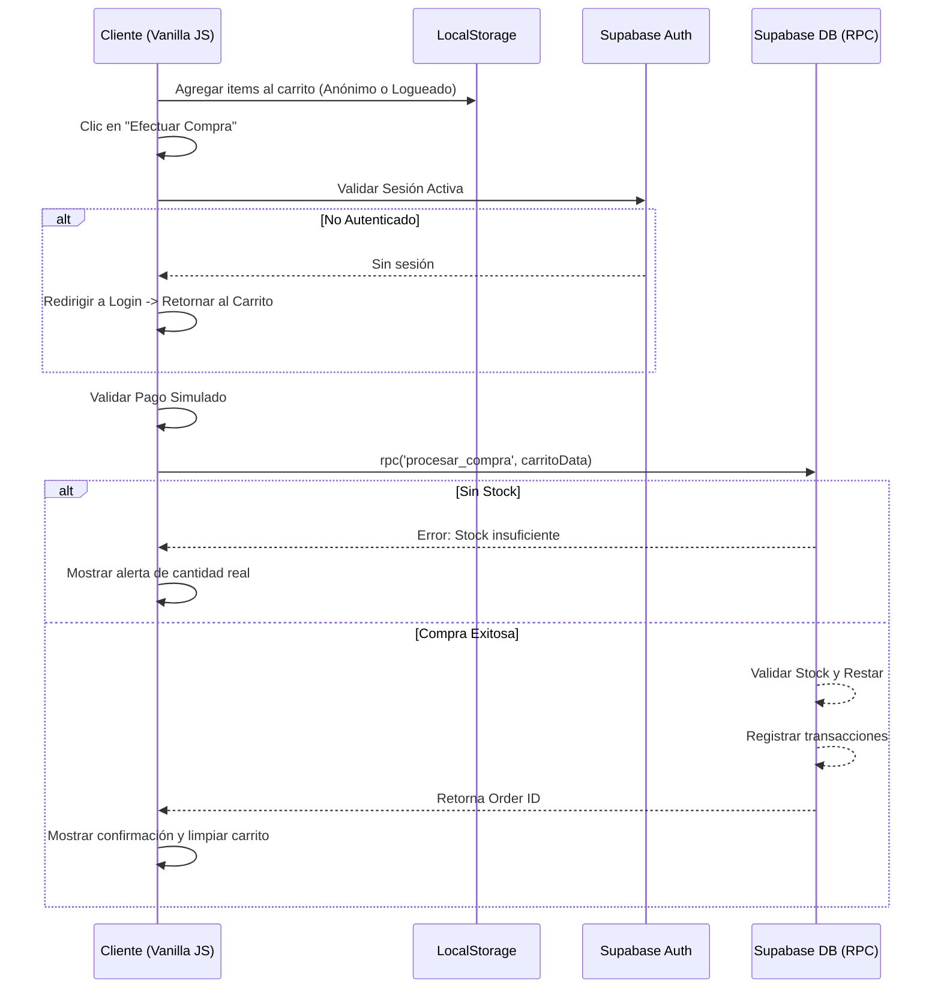

# Entradas, Procesos y Salidas (IPO)

Este documento traduce los [Flujos de Negocio](../02-Requisitos/Flujos_Negocio.md) en interacciones técnicas bajo la arquitectura Cliente-Servidor definida. Utiliza el modelo Entradas-Procesos-Salidas (IPO) para trazar la ruta de los datos desde la interfaz de usuario (Vanilla JS) hasta el Backend as a Service (Supabase/Cloudinary).

---

## Objetivo

Mapear detalladamente cómo los componentes del Frontend envían información, cómo interactúan con las APIs y cómo el sistema responde, brindando a los desarrolladores una guía de integración y trazabilidad entre UI y Base de Datos.

---

## Contenido

### [FL-001] Registro y Gestión de Clientes

**Modelo IPO:**
- **Entrada (UI):** Formulario de registro (`ui-fl001-formRegistro`).
  - Datos: Tipo/Nro de documento, Nombre, Teléfonos, Dirección, Ciudad, Depto, País, Profesión, Email, Password.
- **Proceso (API/JS):**
  - JS: Valida formato de campos obligatorios en el cliente.
  - API: Llama a `supabase.auth.signUp()` para crear credenciales.
  - API: Inserta en tabla `clientes` de PostgreSQL asegurando unicidad del documento.
- **Salida (DOM/UI):**
  - Éxito: Modifica el DOM (`ui-fl001-mensajeExito`) mostrando "Registro completado".
  - Error: Modifica el DOM mostrando el error de validación o conflicto.

**Diagrama de Secuencia:**

---

### [FL-002] Administración de Productos (Muebles)

**Modelo IPO:**
- **Entrada (UI):** Formulario de creación de mueble (`ui-fl002-formMueble`).
  - Datos: Referencia, Nombre, Descripción, Tipo, Material, Dimensiones, Color, Peso, Imagen (Archivo), Precio, Stock.
- **Proceso (API/JS):**
  - JS: Lectura de archivo imagen.
  - API Cloudinary: Sube la imagen y obtiene la URL optimizada (`FOTO_URL`).
  - API Supabase: Inserta en tabla `PRODUCTOS` usando RPC o inserción directa.
- **Salida (DOM/UI):** Actualiza el listado de productos en pantalla (`ui-fl002-listaProductos`).

**Diagrama de Flujo:**

---

### [FL-003] Proceso de Compra

**Modelo IPO:**
- **Entrada (UI):** Botones "Agregar al carrito" y formulario de pago final (`ui-fl003-carrito`).
  - Datos: ID(s) de muebles, cantidades, datos de forma de pago. Sesión del usuario autenticado.
- **Proceso (API/JS):**
  - JS: Almacena carrito temporalmente en memoria o LocalStorage.
  - JS: Simula validación de pasarela de pago (siempre aprueba en el taller).
  - API Supabase: Ejecuta un procedimiento almacenado (RPC) o transacción para:
    1. Insertar el encabezado en `COMPRAS`.
    2. Insertar el detalle en `DET_COMPRAS`.
    3. Disminuir inventario en `PRODUCTOS`.
- **Salida (DOM/UI):**
  - DOM: Genera número de orden en pantalla.
  - UI/Notificación: Envía correo simulado de confirmación de compra.

**Diagrama de Secuencia:**

---

### [FL-004] Visualización de Reportes

**Modelo IPO:**
- **Entrada (UI):** Filtros del reporte (`ui-fl004-filtros`). Fechas, ciudad, tipo.
- **Proceso (API/JS):**
  - API Supabase: Ejecuta queries o vistas precalculadas (`.select()`) filtrando por los campos solicitados.
- **Salida (DOM/UI):** Renderiza tabla en HTML (`ui-fl004-tablaReporte`) con los resultados agregados.

---

## Relación con otros documentos

- [Flujos de Negocio](../02-Requisitos/Flujos_Negocio.md)
- [Base de Datos](Base_Datos.md) (Estructuras de las tablas mencionadas)
- [API](API.md) (Uso del SDK Supabase y Cloudinary)

---

## Navegación

← [Diseño del Sistema](Diseno_Sistema.md)
↑ [Índice de la Carpeta](README.md)
→ [Base de Datos](Base_Datos.md)

[MASTER](../MASTER.md)
