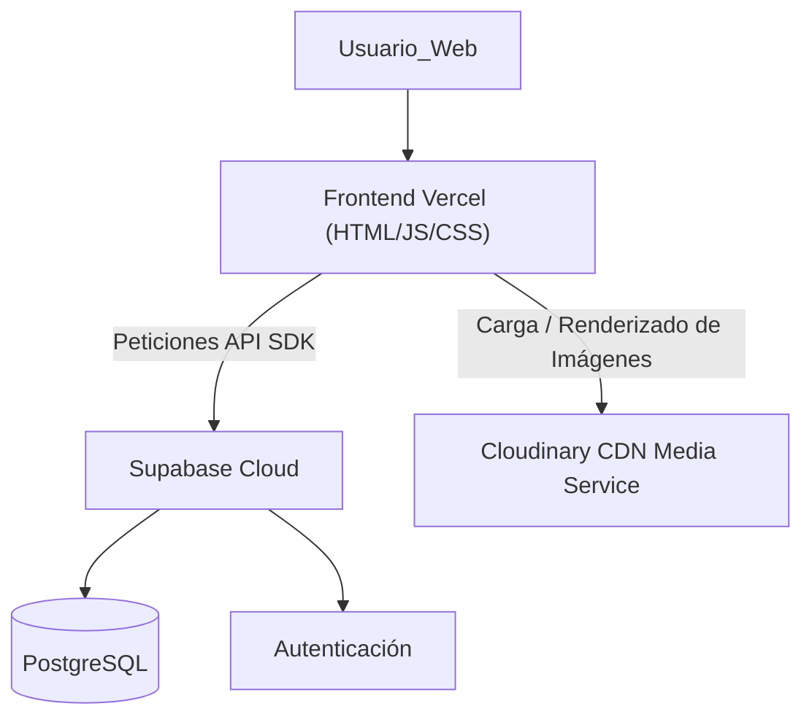

# Infraestructura: Muebles los Alpes

Descripción de los servicios en la nube que soportan la aplicación web.

---

## Objetivo

Documentar los recursos necesarios para que el sistema opere cumpliendo los [Requisitos No Funcionales](../02-Requisitos/No_Funcionales.md).

---

## Contenido

### 1. Proveedores Cloud
Utilizamos **Vercel** para el Frontend estático y **Supabase** para el Backend/Base de datos.

### 2. Recursos por Entorno

#### Entorno: Producción (`prod`)
- **Frontend (Static Hosting):** Vercel. Sirve los archivos HTML, CSS y Vanilla JS globales.
- **Backend (BaaS):** Supabase (Authentication & PostgreSQL DB).
- **Almacenamiento de Fotos:** Cloudinary (CDN externo para almacenamiento, transformación y entrega optimizada de las imágenes de los muebles).

#### Entorno: Local (`local`)
- **Frontend:** Servidor web local ligero (Live Server / http-server).
- **Backend:** Conexión directa a Supabase (mismo proyecto o proyecto de desarrollo).

### 3. Diagrama de Arquitectura de Infraestructura

---

## Relación con otros documentos

El proceso de [Despliegue Manual](Despliegue_Manual.md) interactúa con esta infraestructura para publicar nuevas versiones.

- [Despliegue Manual](Despliegue_Manual.md)

---

## Navegación

← [Índice de Despliegue](README.md)
↑ [Índice de la Carpeta](README.md)
→ [Despliegue Manual](Despliegue_Manual.md)

[MASTER](../MASTER.md)
